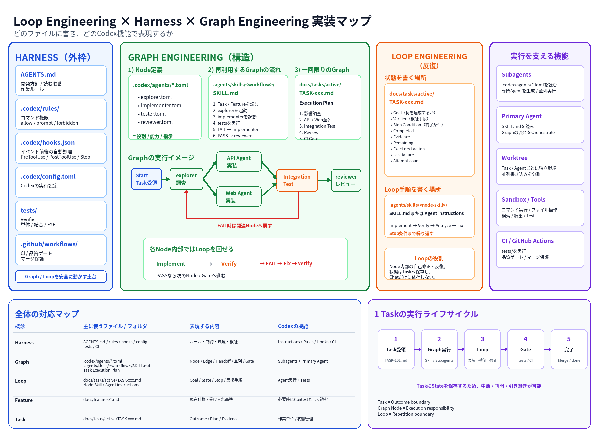

# Codex 開発アーキテクチャ

> [!IMPORTANT]
> **Status: Versioned Reference — not ZizAI Current Specification.** ZizAIの現行仕様は[Architecture](../features/architecture.md)、採用済みTopologyは[ADR-v23](../decisions/ADR-v23-application-topology.md)を正とする。本資料の一般例やTarget構成は、DecisionまたはTaskで明示採用されない限りZizAIへ適用しない。

更新日: 2026-08-15

## 1. 目的

Codex を使って長期開発する際に、

- ChatやContextの肥大化を防ぐ
- 仕様・Task・進捗を会話だけに依存させない
- 並列開発を安全に行う
- Harness / Guardrail / Test を使って品質を担保する

ための基本方針を定義します。

## 2. 結論

Codex 開発では、**ChatをOutcome単位で分け、Taskを入口にFeatureの現在仕様を参照し、並列開発はWorktreeで分離し、Tests / CIで完了を証明する**方針を採用します。

---

## 3. 抽象原則

### 3.1 Project と Chat

**[公式]**

OpenAI は、継続的な作業や同じファイル群に依存する作業を Project にまとめ、Chat は **distinct outcome（明確に異なる成果）ごとに分ける**方針を示しています。

- 同じコードベース → 同じ Project
- 同じ成果 → 同じ Chat
- 別の成果 → 別 Chat
- 独立して並列可能なコード変更 → 別 Chat + Worktree

参照:
- https://learn.chatgpt.com/docs/projects
- https://learn.chatgpt.com/docs/long-running-work

### 3.2 Context を肥大化させない

**[公式]**

OpenAI の Subagents ドキュメントでは、main chat に探索ログ・テストログ・stack trace などを集めすぎる問題を **Context pollution**、関係の薄い情報が蓄積して信頼性が落ちる問題を **Context rot** と説明しています。

Main Chat に残すもの:

```text
Requirements
Decisions
Current state
Final evidence
```

Main Chat から外すもの:

```text
探索結果
raw logs
stack traces
反復したtest出力
却下済み仮説
```

探索・テスト・ログ解析は Subagent に委譲し、Main Chat には要約だけ戻します。

参照:
- https://learn.chatgpt.com/docs/agent-configuration/subagents

### 3.3 Durable State を会話外へ出す

長期開発では、仕様・Task状態・決定を Chat 履歴だけに残しません。

```text
現在仕様  → docs/features/
設計判断  → docs/decisions/
Task状態  → docs/tasks/
引継ぎ    → docs/handoffs/
```

この具体的な配置は **[プロジェクト方針]** です。

---

## 4. Codex に与える情報の構造

### 4.1 `AGENTS.md`

**[公式]**

Codex は `AGENTS.md` を project guidance として読みます。

- nested scope を使える
- `AGENTS.override.md` で局所的にoverrideできる
- instruction chain の既定上限は 32 KiB

参照:
- https://learn.chatgpt.com/docs/agent-configuration/agents-md

このプロジェクトでは `AGENTS.md` を巨大な仕様書にせず、次だけを置きます。

- Repositoryの目的
- 重要な禁止事項
- 必須Verification
- Docsの入口
- Skillを使う条件

### 4.2 Skills

**[公式]**

Codex Skills は progressive disclosure を使います。

Repository scoped skills:

```text
.agents/skills/
```

向いている内容:

- 繰り返し使う検証手順
- 仕様変更時の手順
- Conflict解消手順
- Release確認手順

参照:
- https://learn.chatgpt.com/docs/build-skills

### 4.3 Prompt

**[公式]**

大きなTaskでは、必要に応じて次を明確にします。

```text
Goal
Context
Boundaries
Verification
Output
```

参照:
- https://learn.chatgpt.com/docs/prompting
- https://learn.chatgpt.com/docs/long-running-work

最小形:

```md
## Goal
達成する結果

## Context
必要なSpec・Task・実装ファイル

## Boundaries
変更禁止範囲・互換性・制約

## Verification
完了を証明するTest

## Output
変更内容・Test結果・未解決事項
```

---

## 5. Agent の分割

### 5.1 Subagents

**[公式]**

Subagent は、Main Chat のContextを汚しやすい独立作業へ向いています。

例:

- Codebase探索
- Test実行
- Log解析
- Review

Project scoped custom agents:

```text
.codex/agents/
```

参照:
- https://learn.chatgpt.com/docs/agent-configuration/subagents

### 5.2 Chat 分割

同じ outcome は同じ Chat で継続します。

別 outcome になった場合は新しい Chat に分けます。

同時に code write する場合は Worktree を使います。

---

## 6. Harness Engineering

### 6.1 本質

**[外部資料 / 2026-07-20]**

Harness Engineering の本質は、**Modelの能力そのものではなく、Modelが動く外側の実行系を設計すること**です。

期間内の研究例では、Harness が次を強制しています。

- Compilation
- Correctness
- Timing / Evaluation
- Artifact保存
- 実行可能な候補の選別

一方、Agentはその制約の内側で候補を生成します。

つまり、Modelに

```text
「正しく判断してほしい」
```

と期待するのではなく、

```text
Model
  ↓
制約されたAction
  ↓
機械的なValidation
  ↓
Passしたものだけ次へ進める
```

という外部構造を作る考え方です。

参照:
- https://arxiv.org/abs/2607.17979

### 6.2 このプロジェクトへの適用

**[LLM解釈]**

このプロジェクトでは、Harnessを次へ分散配置します。

```text
AGENTS.md            → 基本指示
.agents/skills/      → 再利用手順
.codex/agents/       → Agent role
.codex/rules/        → Command guardrail
.codex/hooks.json    → Lifecycle check
docs/                → 仕様・状態
tests/               → Verification
.github/workflows/   → CI
```

`.codex-harness/` という専用フォルダは使用しません。

Harnessで重要なのはフォルダ名ではなく、次をModelの外側に持つことです。

```text
制約
状態
検証
停止条件
権限
再利用手順
```

### 6.3 Harness 6要素の責務分離（MECE）

#### 結論

**[プロジェクト方針]**

`AGENTS / Docs / Rules / Hooks / Tests / CI` は、機能としては一部重なります。
そこで「何を定義・保存する場所か」を次のように固定し、同じルールを複数箇所へ重複記載しません。

| 要素 | 主責務 | 一言でいうと |
|---|---|---|
| `AGENTS.md` | Agentへの恒久的な行動指示 | **どう作業するか** |
| `docs/` | 仕様・判断・Task状態 | **何が正しいか** |
| `.codex/rules/` | Command実行の権限制御 | **何を実行してよいか** |
| `.codex/hooks.json` | Lifecycle Eventへの自動反応 | **いつ自動処理するか** |
| `tests/` | 期待動作をExecutableに定義 | **何を満たせば正しいか** |
| `.github/workflows/` | 統合時の自動実行・Gate | **いつ何を強制実行するか** |

この境界により、同じ内容は原則1か所だけをSource of truthにします。

```text
仕様       → Docs
行動指示   → AGENTS
Command権限→ Rules
Event処理  → Hooks
合否条件   → Tests
統合Gate   → CI
```

#### MECEか？

厳密な機能分類としては完全MECEではありません。

例:

- CIはTestsを実行する
- HooksもTestやValidationを呼び出せる
- AGENTSからDocsやTestsを参照する
- RulesとSandbox / Approvalは実行制御で連携する

ただし、**「定義を所有する場所」**を上表のように1つへ固定すれば、Repository運用上はMECEにできます。

原則:

```text
Definition = 1か所
Execution  = 複数箇所から可
Reference  = 複数箇所から可
```

例えば、

```text
「Unit Testの期待値」
```

は `tests/` にだけ定義し、

```text
AGENTS.md
Hooks
CI
```

にはTest内容を複製せず、「そのTestを実行する」とだけ記載します。

OpenAI公式でも、`AGENTS.md` はProject normsやReview rulesを簡潔に記載し、Formatting / Lintのような機械的チェックはCIへ寄せることを案内しています。RulesはCommandに `allow / prompt / forbidden` を設定し、HooksはLifecycle Eventに処理を割り当てます。 citeturn529497view4turn529497view1turn529497view3
---

## 7. Guardrails

### 7.1 Sandbox / Approvals

**[公式]**

Sandbox はAgentのmachine accessを制限する技術境界です。

Approval policy は境界を越えるActionの確認条件を決めます。

参照:
- https://learn.chatgpt.com/docs/sandboxing
- https://learn.chatgpt.com/docs/agent-approvals-security

### 7.2 Rules

**[公式]**

Rules はCommandを allow / prompt / forbidden に分類できます。

```text
.codex/rules/
```

参照:
- https://learn.chatgpt.com/docs/agent-configuration/rules

### 7.3 Hooks

**[公式]**

Hooks はLifecycle eventでdeterministic scriptを実行できます。

例:

- PreCompact
- PostCompact
- PreToolUse
- PostToolUse
- Stop

```text
.codex/hooks.json
```

Hooks は補助Guardrailであり、Tests / CI の代替にはしません。

参照:
- https://learn.chatgpt.com/docs/hooks

---

## 8. Loop / Graph Engineering

### 8.0 全体実装マップ

以下は、Harness / Graph Engineering / Loop Engineeringを、Repository上のファイル配置とCodex機能へ対応させた実装図です。日本語テキストは固定フォントで描画しています。




### 8.1 系譜と位置づけ

#### 結論

**Loop Engineeringは「Agentを逐次Promptする人間」をLoopへ置き換える考え方、Graph EngineeringはそのLoop / Agent群を依存関係・分岐・並列・合流・検証で組織化する考え方として扱います。**

#### Boris Chernyの文脈

**[一次資料 / 2026-07-17 Boris Cherny]**

Boris Chernyは `Steps of AI Adoption` で、AI活用が高度になるにつれて次が必要になると述べています。

- end-to-end verification
- automated code review / security review
- 複数Agentを同時に管理するInterface
- `/loop`
- `/batch`
- dynamic workflows
- subagentのworktree isolation
- guardrails

重要なのは、単一のPrompt技法ではなく、**複数Agentを検証・Guardrail・並列実行と組み合わせ、仕事のクラス全体を自動化すること**です。

参照:
- https://www.linkedin.com/posts/bcherny_i-talk-to-engineers-at-other-companies-every-activity-7483695059843043328-kEPH
- https://threadreaderapp.com/user/bcherny

Borisの公開例では、Loopは単なる

```text
Implement
→ Test
→ Fix
```

だけではありません。

```text
仕事を継続的に監視
→ Agentを起動
→ 必要ならSubagentへ分解
→ 結果を検証
→ 修正・再実行
→ 次の仕事を継続
```

という、Agentを人間が逐次Promptしなくても仕事が回る外側の仕組みまで含みます。

#### Graph Engineeringという語について

**[外部資料 / 2026-07-18以降]**

2026-07-18、Peter Steinbergerが、

```text
Are we still talking loops or did we shift to graphs yet?
```

と投稿し、LoopからGraphへの議論が大きく広がりました。

ただし、この投稿自体はGraph Engineeringの正式な定義でも、用語の発明宣言でもありません。

したがって本資料では、

```text
Boris Cherny
→ Loop / Batch / Dynamic workflow / Multi-agent / Worktree isolationを実運用として提示

Peter Steinberger
→ "loops → graphs?" という議論を増幅

その後の議論
→ 複数Loop / Agentを構造化する設計をGraph Engineeringとして整理
```

という系譜で扱います。

参照:
- https://www.aibuilderclub.com/blog/graph-engineering-peter-steinberger
- https://digg.com/tech/mcw7wsyq

**Boris Chernyが「Graph Engineering」という用語を提唱したとは記載しません。**

---

### 8.2 Loop Engineering

#### 本質

Loop Engineeringの本質は、**人間が毎回次のPromptを書く役割から外れ、Goal・Feedback・Verification・State・Stopを持つLoop自体を設計すること**です。

```text
Human-driven

Human
 ↓ Prompt
Agent
 ↓ Result
Human
 ↓ Next prompt
Agent
```

から、

```text
Loop-driven

Human
 ↓ Goal / Policy

Loop
├─ Discover / Trigger
├─ Agentを起動
├─ Action
├─ Observe
├─ Verify
├─ Decide
└─ Repeat / Stop / Escalate
```

へ移します。

Loopの対象は「コード修正の反復」に限定しません。

例:

```text
PRを監視
→ CI失敗を検出
→ Agentが修正
→ CI再実行
→ PASSまで継続
```

```text
定期的にFeedbackを取得
→ Agentが分類
→ 必要なTaskを作る
→ 実装Agentへ渡す
→ 検証
```

#### Inner loop / Outer loop

Loopは2層で考えます。

```text
Outer loop
├─ Work discovery
├─ Trigger
├─ Task selection
├─ Dispatch
├─ Context routing
├─ Escalation
└─ Next work

    Inner loop
    ├─ Implement
    ├─ Observe
    ├─ Verify
    ├─ Fix
    └─ Repeat
```

このプロジェクトでは、

```text
Outer loop
= どのTaskを、どのAgentへ、どの条件で流すか

Inner loop
= 1 Taskを完了条件までどう自己修正するか
```

とします。

#### 最小核

Loopを成立させる最小核は次です。

```text
Task
+
Verifier
+
Stop condition
```

- **Task**: 何を達成するか
- **Verifier**: 達成したかをどう判定するか
- **Stop condition**: いつ反復を終了するか

Agentへ

```text
完成するまで頑張って
```

とだけ指示するのはLoop Engineeringではありません。

```text
Goal
→ Action
→ External verification
→ PASS / FAIL
→ Next action / Stop
```

という閉ループを作ります。

#### Verifier

Verifierは可能な限り次の順で強くします。

```text
1. Deterministic gate
   compiler / type check / static analysis / unit test / exit code

2. Scoring gate
   数値評価 + threshold

3. Independent model / reviewer
   機械判定できない意味的品質

4. Human gate
   Product / Security / destructive decision等
```

**Maker自身の「Done」を最終Evidenceにしません。**

#### Loop Contract

自律Loopでは最低限、次を外部契約として定義します。

```text
Goal
Trigger
Context
Action boundary
Verifier
State
Stop condition
Resource limit
Escalation
```

| 要素 | 問い |
|---|---|
| Goal | 何を達成するか |
| Trigger | 何をきっかけに開始するか |
| Context | 今回読むべき情報は何か |
| Action boundary | 何を変更・実行してよいか |
| Verifier | 何をもって成功とするか |
| State | 進捗をどこへ保持するか |
| Stop condition | いつ正常・異常終了するか |
| Resource limit | 何回・どの程度まで試すか |
| Escalation | Agentだけで判断不能な時どうするか |

#### Trigger filtering

すべてのEventをModelへ渡しません。

```text
Event
 ↓
Cheap deterministic filter
 ↓
Agent起動が必要か？
├─ No  → Ignore / Record
└─ Yes → Loop
```

これはInvocation数・Context・Cost・Noiseを抑えるためです。

#### Stop / No-progress

成功以外にも停止条件を持ちます。

```text
Success
├─ Tests PASS
├─ Acceptance Criteria satisfied
└─ Required evidence exists

Failure / Escalation
├─ Max attempts
├─ Max elapsed time
├─ Budget limit
├─ Same failure repeats
├─ No progress
├─ Permission missing
└─ Human decision required
```

No-progressの例:

```text
同じErrorを繰り返す
同じDiffを繰り返す
Test結果が改善しない
変更量だけ増えてVerifierが改善しない
```

#### State / Spine

LoopのDurable stateはChatだけへ置きません。

```text
docs/tasks/active/TASK-XXX.md
```

へ最低限、

```text
Completed
Evidence
Remaining
Exact next action
Last failure
Attempt count
```

をCheckpointします。

#### Parallel Loop

独立Loopを並列化する場合:

```text
Loop A → Worktree A
Loop B → Worktree B
Loop C → Worktree C
```

とし、同じWorking treeへ複数の書き込みLoopを走らせません。

#### 参考動画

- https://www.youtube.com/watch?v=ifAt7nkaTww&t=562s

本資料では、動画単独の説明を一般化せず、2026-07-15以降に確認できる一次資料・実運用資料と整合する部分を採用します。

---

### 8.3 Graph Engineering

#### 結論

**Graph Engineeringは、複数のLoop / Agent / deterministic process / human gateを、依存関係とHandoffを持つ1つの実行構造として設計することです。**

#### LoopからGraphへ

単一Loop:

```text
Task
 ↓
Agent
 ↓
Verify
 ├─ FAIL → Agent
 └─ PASS → Done
```

複数の独立した役割が必要になると:

```text
                 ┌→ Research Agent ──┐
Task → Planner ──┤                   ├→ Implementer
                 └→ Spec Checker ────┘
                                      ↓
                                   Tests
                                  /     \
                              FAIL       PASS
                               ↓          ↓
                         Implementer    Reviewer
                                         ↓
                                      Merge gate
```

となります。

この時、1本のLoopとして考えるより、

```text
Nodes
+
Dependencies
+
Handoffs
+
Parallel branches
+
Join points
+
Gates
+
State
```

として設計する方が実態に合います。

#### NodeはAgentに限定しない

GraphのNode候補:

```text
Subagent
Custom agent
Deterministic script
Test suite
Static analysis
Human review
CI gate
External tool
```

したがって、

```text
Graph Engineering
≠ Subagentをたくさん作ること
```

です。

#### SubagentsとOrchestration

ただし、Codex / Claude Codeの実運用では、

```text
Subagent
= Specialist node / Worker node

Orchestration
= どのNodeをいつ起動し、
  何を渡し、
  どこへ結果をHandoffするか
```

としてGraph Engineeringを実装できます。

例えば:

```text
Orchestrator
 ↓
Planner Agent
 ├──────────────┐
 ↓              ↓
API Agent     Web Agent
 │              │
 └──────┬───────┘
        ↓
 Integration Test
   ├─ FAIL → relevant Agent
   └─ PASS
        ↓
    Review Agent
        ↓
      CI Gate
```

ここでは、

```text
Agent
= Node

Task / Artifact / Evidence
= State

Dispatch / Handoff
= Edge

Test result / Review result
= Transition condition

Parent agent / Workflow / Harness
= Orchestrator
```

と整理できます。

#### Boris Chernyの7月17日資料との接続

BorisはGraph Engineeringという語を使ったと確認できませんが、7月17日の資料では高度なAI活用として、

```text
manage multiple agents
/loop
/batch
dynamic workflows
subagent worktree isolation
end-to-end verification
guardrails
```

を同時に挙げています。

これは実装上、

```text
単一Agent Loop
 ↓
複数Agentの並列化
 ↓
Batch / Dynamic workflow
 ↓
Agent間のHandoff
 ↓
Verification / Guardrail
```

というGraph的な構成へ進む条件と整合します。

**用語の帰属と実装上の収束は分けて記述します。**

#### Graphで設計するもの

最低限:

```text
Node
Responsibility
Input
Output
Dependency
Handoff
Transition / Gate
Shared state
Failure route
Parallelism
Join
```

例:

| Node | Responsibility | Input | Output | Next |
|---|---|---|---|---|
| Planner | Task分解 | Task / Feature | Plan | Worker群 |
| API Worker | API実装 | Plan | Diff | Integration |
| Web Worker | Web実装 | Plan | Diff | Integration |
| Integration | 結合検証 | Diffs | PASS/FAIL | Review / Worker |
| Reviewer | 意味的Review | Diff / Spec | PASS/FAIL | Merge / Worker |
| CI | 最終Gate | Branch | PASS/FAIL | Merge / Stop |

#### DeterministicとAgenticを分ける

Graphの全判断をLLMへ任せません。

```text
Task decomposition
→ Agentic

pytest PASS/FAIL
→ Deterministic

Security-sensitive approval
→ Human / Policy gate

Parallel worker selection
→ RuleまたはOrchestrator

Merge eligibility
→ Deterministic CI
```

既知の制約・判定はSystemへ寄せ、不確実な推論だけAgentへ任せます。

---

### 8.4 Loop / Graph / Harness / Subagent / Orchestration の関係

```text
Harness
└─ Agentが動く外側の環境
   ├─ Permission
   ├─ Context
   ├─ Verification
   ├─ State
   └─ Guardrails

Graph
└─ 複数のNodeとHandoffの構造
   ├─ Agent Node
   │   └─ 各Node内部にLoopを持てる
   ├─ Deterministic Node
   ├─ Human Gate
   └─ Join / Branch

Loop
└─ Goal達成まで反復する実行cycle

Subagent
└─ Graph上のNodeになり得る実行主体

Orchestrator
└─ NodeをDispatchし、State / Handoff / Transitionを制御
```

重要:

```text
Loop ⊂ Graph
```

と常に数学的に定義するわけではありません。

実務上は、

```text
Loop
= 1つの自律cycleを設計する視点

Graph
= 複数cycle / role / gateの関係を設計する視点
```

として使い分けます。

### 8.5 このプロジェクトへの適用

最初からGraphを大規模に作りません。

#### Phase 1

```text
1 Task
→ 1 primary Agent
→ Inner Loop
→ Tests / CI
```

#### Phase 2

独立作業が明確な場合:

```text
Task
→ Orchestrator
   ├→ Subagent A / Worktree A
   └→ Subagent B / Worktree B
→ Integration
```

#### Phase 3

反復して使う安定した流れだけGraph化:

```text
Plan
→ Parallel workers
→ Integration
→ Review
→ CI
```

Graph化する条件:

```text
同じHandoffが繰り返される
役割境界が安定している
入力 / 出力が定義できる
Transition条件を外部化できる
並列化・再試行に明確な利益がある
```

逆に、探索的で経路が頻繁に変わるTaskを最初から固定Graphへ押し込みません。

### 8.6 Anti-pattern

#### Agent数 = Graph成熟度と考える

```text
Agentを10個作った
→ Graph Engineering
```

ではありません。

Handoff・State・Gate・Failure routeがなければ、単なる並列Agentです。

#### Orchestratorに全判断を集中

```text
巨大な親Agent
→ 何でも判断
→ 何でも再Prompt
```

はContext bottleneckになります。

既知の判定はTests / Rules / CIへ外出しします。

#### Graphを先に作る

Workflowが安定していないのに、

```text
Planner
→ Architect
→ Implementer
→ Tester
→ Reviewer
→ ...
```

を固定するとCoordination costが増えます。

まずTask / Loopで実運用し、**繰り返し現れる安定したHandoffだけGraphへ昇格**させます。

### 8.7 要約

```text
Prompt Engineering
→ 1回のModel interactionを改善

Loop Engineering
→ Agentを継続的に動かすcycleを設計

Graph Engineering
→ 複数Loop / Agent / Gateを組織化

Harness Engineering
→ それらが安全・検証可能に動く外部環境を設計
```

この4つは置き換え関係ではなく、異なる設計レイヤーです。
---

## 9. 長時間Chatに関する利用者報告

**[利用者報告]**

2026-07-19 の Codex Issue #34095 では、長時間SessionのCompaction後に「完了済み・未完了・次のAction」の状態が劣化した事例が報告されています。

2026-07-29 の Issue #35935 では、Compaction後に完了済み作業を再実行した事例が報告されています。

これらは利用者報告であり、全Sessionに起きる仕様とは扱いません。

参照:
- https://github.com/openai/codex/issues/34095
- https://github.com/openai/codex/issues/35935
- https://community.openai.com/t/undo-and-conversation-pollution-in-codex/1387225

---

## 10. Anti-patterns

### 10.1 結論

**[プロジェクト方針]**

**Context削減・Source of truth・責務分離を損なう設計は採用しません。**

### 10.2 会話から確認できたアンチパターン

#### A. 会話中の比喩や仮説に合わせて、すぐ構成方針を変える

悪い例:

```text
User:
DBの正規化のように考えられないか？

Assistant:
ではDocsも完全に正規化しましょう。
```

問題:

- 比喩は論点整理には使えるが、設計根拠ではない
- 既存の公式仕様・運用知見との整合確認が抜ける
- 会話のたびにRepository構成が揺れる

採用する原則:

```text
User hypothesis
 ↓
Current knowledge / official docsで検証
 ↓
既存方針との整合確認
 ↓
必要な場合だけ変更
```

**ユーザーの発言をそのままArchitecture decisionへ変換しません。**

---

#### B. ドキュメントをDBのように過剰正規化する

悪い例:

```text
login-view.md
login-spec.md
login-api.md
login-ui.md
login-validation.md
login-current.md
```

問題:

- Codexが複数ファイルを探索する必要がある
- 読み込みContextが増える
- 更新箇所が増える
- どれが正本か分かりにくくなる

代わりに:

```text
docs/features/login.md
```

を現在仕様の正本にし、十分大きくなった場合だけ分割します。

---

#### C. Feature View と Spec を二重管理する

悪い例:

```text
features/login.md  → overview
specs/login.md     → actual spec
```

両方に同じBehaviorを書く。

問題:

```text
更新A
 ↓
片方だけ変更
 ↓
仕様不整合
```

代わりに:

```text
Feature document = Current specification
```

とします。

Viewが必要なほど巨大化した場合のみ `index.md` をRouting用途として追加します。

---

#### D. `current / latest / v2 / new` をファイル名で管理する

悪い例:

```text
login.md
login-v2.md
login-current.md
login-latest.md
login-new.md
```

問題:

- 最新判定を人間・Agentが行う必要がある
- 古い仕様を誤参照する
- Task完了後もDraftが残る

代わりに:

```text
現在仕様   → docs/features/login.md
作業中差分 → docs/tasks/active/TASK-XXX.md
過去仕様   → Git history
```

---

#### E. TaskにFeature仕様を全文コピーする

悪い例:

```text
TASK-042.md
└─ login.md の仕様全文をコピー
```

問題:

- 同じ情報が複数Sourceになる
- Feature更新とTask更新の同期が必要
- Contextが無駄に増える

代わりに:

```md
## Source
- `../../features/login.md`

## Change
今回変更する差分だけを書く
```

---

#### F. Repository全体のHarness情報をFeatureごとに複製する

悪い例:

```text
login.md
├─ AGENTS rules
├─ Command restrictions
├─ Hooks
├─ CI
└─ Login specification
```

問題:

- Global ruleとFeature specificationが混ざる
- 同じHarness ruleがFeature数だけ複製される
- Rule変更時の更新漏れが起きる

代わりに:

```text
Repository-wide
├─ AGENTS
├─ Rules
├─ Hooks
└─ CI

Feature-specific
├─ Feature document
└─ Tests
```

---

#### G. 「機能が重なる」ことを理由に、同じ定義を複数箇所へ書く

例:

```text
AGENTS:
pytestを通す

Tests:
期待値を定義

CI:
期待値を再定義

Hooks:
同じ期待値を再定義
```

問題:

CI / Hooks / AGENTS / Testsは相互に関係しますが、**Definition ownershipまで重複させる必要はありません。**

採用する原則:

```text
Definition = 1 place
Reference  = many
Execution  = many
```

例:

```text
Assertion定義 → tests/
実行指示      → AGENTS
自動実行      → CI / Hooks
```

---

#### H. 「整理されて見える」ことだけを理由にファイルを分割する

悪い判断:

```text
300行あるから分割する
見た目をきれいにしたいから分割する
カテゴリごとにファイルを作る
```

分割判断は行数だけでは行いません。

分割する条件:

```text
分割後、
Codexが今回読む必要のないContextを
明確に読み飛ばせるか？
```

Yesの場合だけ分割を検討します。

---

#### I. Task開始時にRepository全体を探索させる

悪い例:

```text
Repositoryを全部調べてLoginを実装してください
```

問題:

- Token消費
- Context pollution
- 関係ないコード・Docsの混入
- 既読ファイルの再探索

代わりに:

```text
Task
 ↓
Feature
 ↓
Implementation references
 ↓
Tests
```

というRoutingを与えます。

---

#### J. ChatをSource of truthにする

悪い例:

```text
仕様変更はChatにだけ存在
Completed内容もChatにだけ存在
次ActionもChatにだけ存在
```

問題:

- Compaction
- Chat分割
- 長時間Task
- Session終了

で状態が失われやすくなります。

代わりに:

```text
Current behavior → Feature
Current work     → Task
Important reason→ Decision
```

へ外出しします。

---

#### K. 結論に説明を詰め込みすぎる

悪い例:

```text
結論:
Aを採用し、その理由はBであり、Cの場合にはDとなり、
構成は以下で、例外として……
```

問題:

- Decisionが見えない
- Detailsとの重複
- Agentが重要度を判断しにくい

採用形式:

```text
目的
↓
結論      ← Decisionだけ
↓
抽象原則
↓
具体
```

---

### 10.3 Anti-pattern判定基準

新しい構成・Documentを追加する前に、次を確認します。

```text
1. Source of truthが増えていないか？
2. 同じ内容をコピーしていないか？
3. Codexが読むファイル数を不要に増やしていないか？
4. 最新版を判定する作業をAgentに要求していないか？
5. Global ruleとFeature-specific情報を混在させていないか？
6. Chatだけに重要状態を残していないか？
7. 分割によって実際にContextを削減できるか？
8. 変更理由が公式知見・検証・Project requirementのどれかに基づいているか？
```

1つでも問題がある場合は、構成追加を再検討します。

### 10.4 要約

```text
Do not normalize for normalization.
Do not duplicate truth.
Do not make Codex discover what we can route.
Do not make "latest" a reasoning task.
Do not store durable state only in chat.
Do not change architecture just to mirror a conversational analogy.
```


---

## 11. Task粒度

Taskは、**単一のOutcomeを持ち、独立して実装・検証・マージできる最小の意味ある変更単位**です。

判定軸:

```text
Outcome
Verification
Atomicity
Context
```

詳細は `07_development-process.md` の「1 Taskとは何か」を参照します。

Loop EngineeringとRepository構成との対応は `05_repo-worktree-folder-structure.md` を参照します。

---

## 12. Existing Repository Adoption

既存Repositoryへ本Architectureを適用する場合、最初にRead-only Auditを行います。

推奨:

```text
Claude Code
→ Existing Repository Audit

Codex
→ Mapping / Task decomposition / Migration

Claude Code
→ Independent final audit
```

具体的なPromptは `02_templates.md` の「Claude CodeによるRepository Audit」を参照します。
